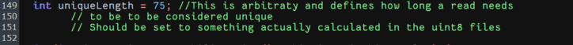
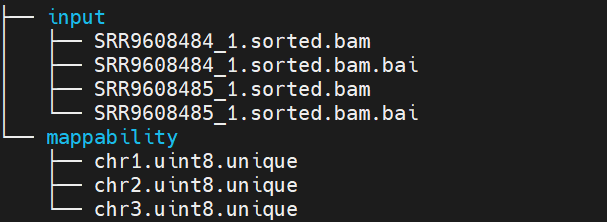
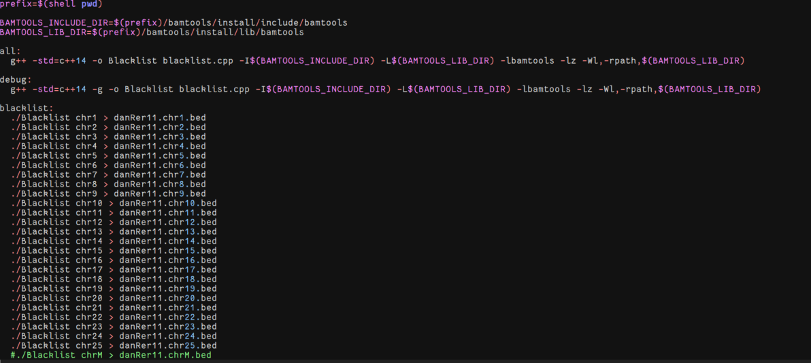

# 1.Clone this project.
$ git clone https://github.com/Cas660/Blacklist  
$ cd Blacklist
# 2. Generate the reference genome mappability data.
## step1: Use conda to create an independent environment (Python 2.7)
$ conda create -n Umap_env python=2.7  
$ conda activate umap_env
## step2：Install Required Packages
$ conda install bowtie=1.2.3  
$ pip install argparse numpy pandas  
$ conda install samtools=1.21  
## step3：Install Umap version 1.2.1
Download version 1.2.1 of Umap from the [hoffmangroup/umap project](https://github.com/hoffmangroup/umap/tags)  and extract it.  
$ cd umap-1.2.1/umap  
$ mv ../../Run_Umap.sh ./  
$ mkdir mappability_data 
$ cd mappability_data
## step4：Download the reference genome files.
To ensure that the final generated genome blacklist is in the format "chr15 62500 107500 Low Mappability", the first line of the genome file should start with something like >chr1.
Here, I recommend that you download the reference genome files from the [UCSC Genome Browser](https://genome.ucsc.edu/cgi-bin/hgGateway).  
e.g. $ rsync -avzP rsync://hgdownload.soe.ucsc.edu/goldenPath/danRer11/bigZips/danRer11.fa.gz .  
$ gunzip danRer11.fa.gz
$ cd ..
## step5：Generate genome mappability data
Usage: bash Run_Umap.sh <genome_file> <kmer_list>  
$ ./Run_Umap.sh danRer11.fa.gz 24,36,50,75,100,150,200  
This step takes a relatively long time to run, so you can let it run in the background. 

# 3. Generate blacklist.
##  step1. install Blacklist(v2.0)
Before compiling the source code, please ensure that line 149 in blacklist.cpp has been edited to match the length included in the k-mer list from the previous mappability file. Otherwise, the program may incorrectly mark entire chromosomes as blacklist regions. For example, if the k-mer list used to run the Umap software is "50,75", then "int uniqueLength = 36" on line 149 in blacklist.cpp needs to be changed to either "int uniqueLength = 50" or "int uniqueLength = 75". 
 
$ git clone https://github.com/Boyle-Lab/Blacklist 
$ cd Blacklist 
$ rm -rf bamtools 
$ git clone https://github.com/pezmaster31/bamtools.git 
$ cd bamtools 
$ mkdir build 
$ cd build 
$ cmake -DCMAKE_INSTALL_PREFIX:PATH=$(cd ..; pwd)/install .. 
$ make 
$ make install 
$ cd ../.. 
## step2.Move the BAM files and mappability files into the "input" and "mappability" folders, respectively.
$ mkdir input 
$ mkdir mappability 
Move all bam files and their index to the input folder. 
Move the mappability files to the mappability folder. 

## step3. generate blacklist.
First, hard-code the Makefile file by adding the chromosomes you need to generate the genome blacklist as shown in the figure below, and then run the command 'make blacklist' to generate the required blacklist in one go.

$ make blacklist
